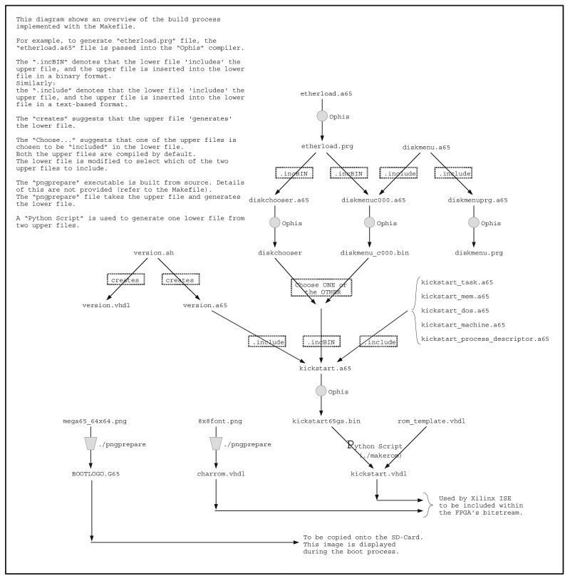

## This is the 'build' documentation file.

# Table of Contents:

[Introduction](#introduction)  
[Downloading Repository](#downloading-repository)  
[Compiling](#compiling)  
[Modifying the design using ISE](#modifying-the-design-using-ise)  
[Programming the FPGA via USB](#programming-the-fpga-via-usb)  
[Programming the FPGA via sdcard](#programming-the-fpga-via-sdcard)

## Introduction

Thanks for justburn for his contributions on getting this file started!

The overall process from go-to-whoa takes about 60 minutes.

Basically you:

1. download the repository from github (5 mins),
1. compile the design into a bitstream (40 - 240 mins),
1. copy bitstream onto fpga board (5 mins).

Detailed instructions are below.

## Downloading Repository

The following is assumed:

1. you have linux, say, Ubuntu 16.04
1. you have git installed, if not, use the following:
```
$> sudo apt-get install git
```

Make a working directory for your project, we refer to that working directory as ```$GIT_ROOT```
```
$> cd $GIT_ROOT
```
Clone the following two git repositories into your working directory
```
$GIT_ROOT$> git clone https://github.com/MEGA65/mega65-core.git
$GIT_ROOT$> git clone https://github.com/gardners/Ophis.git
$GIT_ROOT$> 
```
You should now have two directories in your working directory, ie ```mega65-core``` and ```Ophis```.

If you have a github account, and use SSH keys to avoid being prompted for your github password,
use the following command to tell git to always use SSH instead of HTTPS when comminicating with
the github.com servers:

```
git config --global url.ssh://git@github.com/.insteadOf https://github.com/
```

Change directory into the ```mega65-core``` working directory.
```
$GIT_ROOT$> cd mega65-core
$GIT_ROOT$/mega65-core>
```

Currently, the ```px100mhz``` branch is what you should compile.  
So, checkout that branch:  
```
$GIT_ROOT$/mega65-core> git checkout px100mhz
Branch px100mhz set up to track remote branch px100mhz from origin.
Switched to a new branch 'px100mhz'
$GIT_ROOT$/mega65-core>
```

If you want to try a different (development) branch, do the following:  
e.g., to see/use the example ```banana``` branch, type ```$GIT_ROOT$/mega65-core> git checkout banana```.  
To change to the ```MASTER``` branch, type ```git checkout master```.

You may want to type ```git status``` or ```git branch``` to check what branch you have checked out.  

To make sure that you have the latest files, all you have to do is type:
``` 
$GIT_ROOT$/mega65-core> git pull
```

## Submodules

The project uses submodules, which are other git-projects used within this project.  
Therefore, you need to do the following:  

```
$GIT_ROOT$/mega65-core> git submodule init

Submodule 'src/mega65-fdisk' (https://github.com/MEGA65/mega65-fdisk.git) registered for path 'src/mega65-fdisk'

$GIT_ROOT$/mega65-core> git submodule update

Cloning into 'src/mega65-fdisk'...
remote: Counting objects: 171, done.
remote: Compressing objects: 100% (36/36), done.
remote: Total 171 (delta 32), reused 42 (delta 20), pack-reused 115
Receiving objects: 100% (171/171), 69.77 KiB | 0 bytes/s, done.
Resolving deltas: 100% (97/97), done.
Checking connectivity... done.
Submodule path 'src/mega65-fdisk': checked out 'bb81b3b5244b916f7c82c947693cba31787c8b97'

$GIT_ROOT$/mega65-core>
```

You are now ready to compile the design.

## Compiling

The following is assumed:

1. you have ```gcc``` installed (I have ver 5.2.1) (for compiling c.*)
1. you have ```make``` installed (I have 4.0) (for the makefile)
1. you have ```python``` installed (I have ver 2.7.10) (for some scripts)
1. you have ```libpng12-dev``` installed (for the image manipulation)
1. you have ```cbmconvert``` installed (I have ver 2.1.2) (to make a D81 image)
1. you have Xilinx ISE 14.7 WebPACK installed, with a valid licence

Overview of the compile process:  

1. make bin/<board type>.bit
1. optionally: see design run in fpga hardware (to do)
1. optionally: see design run in ghdl simulator (to do)

The following instructions are for running in the fpga.  

* As there are many end-use cases, i will not cover them all here, just the one that suits me.  
Someone else please document how the simulate function(s) work and what compile options etc.  

In your working directory, type the following:
```
$GIT_ROOT$/mega65-core> make bin/nexys4ddr.bit
$GIT_ROOT$/mega65-core> 
```
The Makefile performs two main tasks:  

1. Generates a number of files used in the VHDL design, and then, 
1. issues several commands to build the design using ISE commands.  

The image below may be useful to understand which file builds what file during the pre-compile.   
PLEASE NOTE that this file is now outdated.  

[](./images/precomp.jpg)  
Click the image above for a hi-res JPG, else the [PDF link](./images/precomp.pdf).  

During the pre-compile, ```Ophis``` may generate the following warnings, but these are OK:
```
WARNING: branch out of range, replacing with 16-bit relative branch
```

During the compile of the design (using ISE commands), many warnings are generated and listed in the relevant log-files. It was thought appropriate to hide these warnings from the user during compilation to make it easier to determine what part of the compile it is up to. If compile fails, (or completes), you are strongly encouraged to browse the log-files to examine the output generated during compile.  Note that at the time of writing, the design does not meet timing closure. This will be fixed.
There are two sets of log-files:

1. log files are generated by ISE commands, including *.XRPT, *.syr, *.log, etc, and
1. log files are generated by the ```./compile.sh``` script, ie: ```compile-<date><time>_N.log```, where N is one of the six stages of ISE compile.


## Modifying the design using ISE

Open ISE, and then ```Project -> Open``` and choose the ```"mega65"``` project.

You should be able to double-click on the ```"Generate Programming File"``` and a bit-stream should be created. (To-be-reconfirmed)  

NOTE that every compile of a bitstream that is destined for the FPGA, should be compiled using ```make bin/<boardname>.bit``` script, because this script ensures that that all VHDL files are generated correctly. For example, the Kickstart/Hypevisor ROM is generated in this way.

## Programming the FPGA using fpga-board and the monitor_load command

The monitor_load program is compiled as part of the build process. This can be used to
load a bitstream and/or custom Kickstart/Hypervisor version, among other functions.

A command like the following will load and start the desired bitstream and Kickstart/Hypervisor
files you provide. You must have the USB programming cable connected for this to work. This
procedure works on Nexys4 as well as MEGA65 prototype main boards with the FPGA programming
module attached.  It is much faster (~3 seconds versus ~13 - 30 seconds) than loading a bitstream
from an SD card, and saves you the hassle of removing and inserting SD cards. monitor_load can
also be used to auto-switch to C64 mode on start (-4 option), and/or to load and optionally run
a user-supplied program on boot (see the usage text for monitor_load for details), providing a
greatly simplified work-flow.

```monitor_load -b <bitstream.bit> -k <KICKUP.M65>```

## Programming the FPGA via USB (DEPRECATED IN FAVOUR OF monitor_load)

To get the bitstream onto the FPGA, you can use either the USB-Stick or the SD-card. See next section for sdcard.  

To load the bitstream into the Nexys 4 DDR board via USB stick:

1. you need a USB stick formatted as FAT32
1. copy the bitstream to the root directory of the USB stick
```
$GIT_ROOT$/mega65-core> cp *.bit /media/sdc1
```

1. power OFF nexys board
1. place USB stick into the USB_HOST header
1. set jumper JP2 to USB
1. set jumper MODE to USB/SD
1. power ON nexys

Upon powerup, the bitstream is copied from USB into FPGA, then the FPGA executes it.

## Programming the FPGA via sdcard (DEPRECATED IN FAVOUR OF monitor_load)

Alternatively, the bitstream can be put onto an SD-card and that SD-card inserted into the Nexys 4 board. If you choose to use this method, just follow the above instructions re the use of the USB-stick, but change the "jumper JP2 to SD".  

The End.
