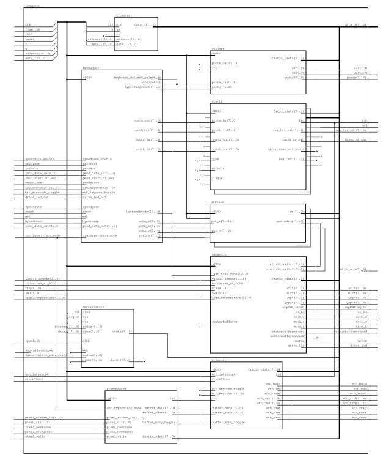

## This is the **structural** documentation file.

# Table of Contents:

[Introduction](#introduction)

The following components are currently documented (at least in part):

* [container](#container)
* [container/ddrwrapper](#ddrwrapper) - **now removed**
* [container/machine](#machine)
* [container/machine/iomapper](#iomapper)
* [container/machine/iomapper/kickstart](#kickstart)
* [container/machine/iomapper/framepacker](#framepacker)
* [container/machine/iomapper/cia](#cia)
* [container/machine/iomapper/c65uart](#c65uart)
* [container/machine/iomapper/keymapper](#keymapper)
* [container/machine/iomapper/sid](#sid)
* [container/machine/iomapper/ethernet](#ethernet)
* [container/machine/iomapper/sdcardio](#sdcardio)
* [container/machine/iomapper/farcallstack](#farcallstack)
* [container/machine/monitor](#monitor)

## Introduction

This page will give an overview of *some* of the components, especially the components at the upper levels. For lower-level components, it is recommended that state-machine diagrams or data-flow diagrams be used.

Contributors: please order the components within this file as they appear in Xilinx ISE.

## container
The toplevel component within the fpga design.  
  
Click the image above for a hi-res JPG, else the [PDF link](./images/machine.pdf).  
**NOTE that the DDRcontroller/DDRwrapper component needs to be removed from image**

This component (for example)(to be revised):
* 48MHz clock comes in, is buffered and fed to a CLKDLL  
* the CLKDLL outputs four clock signals that are used within the design  
* clk_out0 - designed to be 48MHz  
* clk_out1 - designed to be 24MHz  

The [machine](#machine) component holds the significant rest of the architecture.

Other 'logic' includes signal routing, input debouncing, etc.

## ddrwrapper
This component has temporarily been removed. Need to update image.

## machine
This component holds most of the fpga design, including CPU, Memory, VIC/SID chips etc.  

Sub-components include:  
* "viciv" (to be do)  
* "gs4510" (to be do)  
* "[iomapper](#iomapper)"  
* "[monitor](#monitor)"

As shown in the diagram below, the "machine" component holds the four sub-components listed above.  
In addition, the "machine" component includes:
* a process to generate interrupt/reset,  
* a process for reset-logic, LEDs, 7-seg display,  
* a process to generate "phi0",  
* a process to manipulate "pmod" header.  

  
Click the image above for a hi-res JPG, else the [PDF link](./images/machine.pdf).

## iomapper
This components includes the following functionality:  
* implements the "SID"/sound chip(s) of the Commodore 64,
* implements the "CIA"/timer chip(s) of the Commodore 64,
* provides multiple external interfaces: keyboard, uart, SDcard, ethernet, etc.

Sub-components include:  
* "[kickstart](#kickstart)"  
* "[framepacker](#framepacker)"  
* "[cia](#cia)"  
* "[c65uart](#c65uart)"  
* "[keymapper](#keymapper)"  
* "[sid](#sid)"  
* "[ethernet](#ethernet)"  
* "[sdcardio](#sdcardio)"  
* "[farcallstack](#farcallstack)"  

  
Click the image above for a hi-res JPG, else the [PDF link](./images/iomapper.pdf).

## kickstart
This component is basically just a ROM, and is just implemented using processes, ie no sub-components.

## framepacker
This component seems not-required for core functionality of the MEGA65.  
It seems to sub-sample the video stream and buffer this for later transmission to the ethernet component.  
This component contains:
* two "videobuffer" components, which are currently RAM components of size "8-bit by 4096" each, and  
* one "CRC" component, which seems to calculate the CRC for ethernet transmission.  

Also refer to the "ethernet" controller.

## cia
There are two of these components.  
To do.

## c65uart
To do.

## keymapper
To do.

## sid
This component implements the sound chip of the C64/C65.  
The MEGA65 project uses stereo (LEFT and RIGHT) audio channels, whereas the c64 just uses a mono channel.  
I understand that this module was sourced from another online C6x project.  
This component contains:
* three channels each using the "sid_voice" component,  
* "sid_filter" and "sid_coeffs" subcomponents.
* some top-level process(es) to hook everything up.

## ethernet
This component seems to implement an ethernet interface.  
Currently it is not entirely understood.  
This component contains: (enuff that it probly warrants a drawing)
* a RX and TX buffer, of size "8-bit by 4096" each,
* a CRC component for each of the RX and TX data streams,
* an RRNET buffer, of size "8-bit by 4096", and
* two StateMachines, one for RX and one for TX, and
* process(s) to do memory-mapping (of the ETH-state for c65-mode ???)

## sdcardio
This component seems to be multi-purpose:
* provides an interface to the SDcard  
* interfaces to switches/buttons/colourram/audioin/audioout  

It is suggested that this component be broken up into more discrete components.  

This component contains: (enuff that it probly warrants a drawing)
* three RAM components, each of size "8-bit by 512",
* a single StateMachine to do all the work

## farcallstack
This component seems to be a dualport RAM, and is just implemented using processes, ie no sub-components.  
The size is "64-bit by 512".  
I think this component samples the CPU InstructionRegister, ProgramCounter, A,X,Y-registers, ALU-state, etc, and stores these in a circular-buffer. This data can be accessed from the buffer when the Hypervisor-mode is used, or by using the UART-debugger.  
This component is not fully understood.  

## monitor
This components includes the following functionality:  
* provides a debug interface between FPGA and host-PC
* refer to the [monitor](./monitor.md) page for details on how to use this component

Sub-components include:  
* "uart_rx" (simple serial UART that RX'es bytes)  
* "uart_tx" (simple serial UART that TX'es bytes)  
* "historyram" (a RAM used for storing the CPU states)  

  
Click the image above for a hi-res JPG, else the [PDF link](./images/monitor.pdf).

The End.
