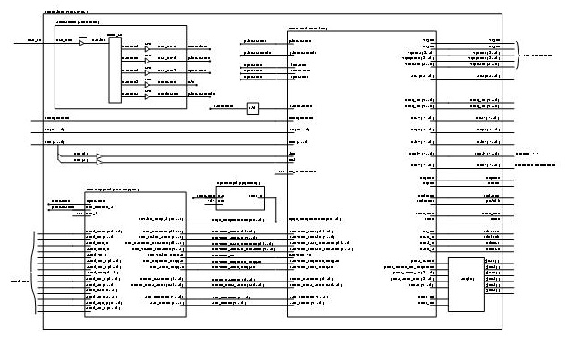
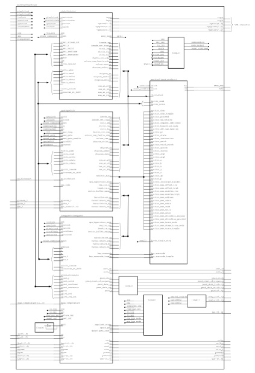

## This is the **structural** documentation file.

# Table of Contents:

[Introduction](#introduction)

The following components are currently documented (at least in part):

* [container](#container)
* [machine](#machine)
* [ddrwrapper](#ddrwrapper) - **now removed**

## Introduction

This page will give an overview of *some* of the components, especially the components at the upper levels. For lower-level components, it is recommended that state-machine diagrams or data-flow diagrams$

Contributors: please order the components within this file as they appear in Xilinx ISE.

## container
the toplevel component within the fpga design 
( [PDF](./images/container.pdf) 2Mb )
  
**DDRcontroller/DDRwrapper component needs to be removed from image**

ie: 48MHz clock comes in, is buffered and fed to a CLKDLL  
ie: the CLKDLL outputs four clock signals that are used within the design  
ie: clk_out0 - designed to be 48MHz  
ie: clk_out1 - designed to be 24MHz  

The [machine](#machine) component holds the significant rest of the architecture.

Other 'logic' includes signal routing, input debouncing, etc.

## machine
this component holds most of the fpga design, including CPU, Memory, VIC/SID chips

## ddrwrapper
now removed temporarily to lessen compile time, as it was not functioning

The End.
